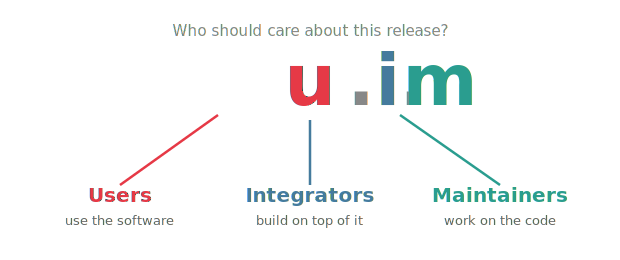

#+title: Intentional Versioning 1.0
#+subtitle: intver.org — [[https://creativecommons.org/publicdomain/zero/1.0/][CC0 1.0]] — [[https://bzg.fr][bzg]]

* Releases are messages for an audience

/Intentional Versioning/ uses version numbers to tell *who* should care
about a release.

A version number =x.y.z= addresses three audiences:

#+attr_html: :style text-align:center

- =x= --- *Users* :: The people who use the software. Incrementing =x= says:
  /"Users, this release is for you."/
- =y= --- *Integrators* :: The people who build on top of the software:
  API consumers, plugin authors, packagers. Incrementing =y= says:
  /"Integrators, this release is for you."/
- =z= --- *Maintainers* :: The people who work on the software itself.
  Incrementing =z= says: /"Maintainers, this release is for you."/

* Rules

1. A version has the form =x.y.z= where =x=, =y= and =z= are non-negative
   integers.
2. Increment the component that matches the audience you are
   addressing with this release. Reset the components to its right to
   zero.
3. An increment means /"this release deserves your attention"/. It does
   not imply a level of severity. The details belong in the changelog.
4. A release can address multiple audiences. When it does, increment
   the leftmost relevant component.

* Being explicit about your audiences

The three default audiences – users, integrators, maintainers – fit
most projects. If yours doesn't have distinct integrators, it won't
change much. That's fine. 

If you want to be more explicit, define your audiences in your README:

#+begin_example
This project uses Intentional Versioning (intver.org).
- x: teachers and students (users)
- y: LMS plugin developers (integrators)
- z: core contributors (maintainers)

Badges:

#+end_example

* Breaking changes

Version numbers say who should pay attention. 

To say what /breaks/, you can use the git trailing =BREAKING-CHANGE:=, as
recommended in conventional commits. Or you can use more specific git
trailers:

#+begin_example
feat: Redesign the dashboard

New layout with improved accessibility.

Breaks-Users: the settings page has moved to the profile menu
Breaks-Integrators: DashboardConfig.load() now returns a Result type
#+end_example

Three trailers are available, one per audience:

- =Breaks-Users:=
- =Breaks-Integrators:=
- =Breaks-Maintainers:=

The absence of a trailer means that nothing breaks.

* FAQ

- *How is this different from Semantic Versioning?* :: Semver encodes
  /what changed/ (patch, feature, breaking change). IntVer encodes /who
  should care/. Semver tries to describe the code and signal its
  audiences at the same time, which creates tension: a bugfix can be
  breaking for some users, and a major API change can be irrelevant to
  most. IntVer separates these concerns --- the version number
  addresses audiences, git trailers describe what breaks.

- *Does incrementing =x= mean a breaking change?* :: No. It means users
  should pay attention to this release. It might be a major new
  feature, a redesign, or a breaking change. The nature of the change
  belongs in the changelog and in git trailers, not in the version
  number.

- *What if my project only has two audiences?* :: Then one of the three
  components won't change often. A CLI tool with no plugin system will
  rarely increment =y=. The scheme still works --- it just reflects the
  reality that this project doesn't have a distinct integrator
  audience.

- *Can I use pre-release or build metadata (e.g. =1.2.3-beta=)?* :: IntVer
  does not specify pre-release or build metadata conventions. You are
  free to adopt whatever convention suits your project.

- *Is IntVer compatible with tools that expect semver?* :: The format
  =x.y.z= is identical, so most tools will accept IntVer version
  strings. The /meaning/ is different, but the structure is the same.
